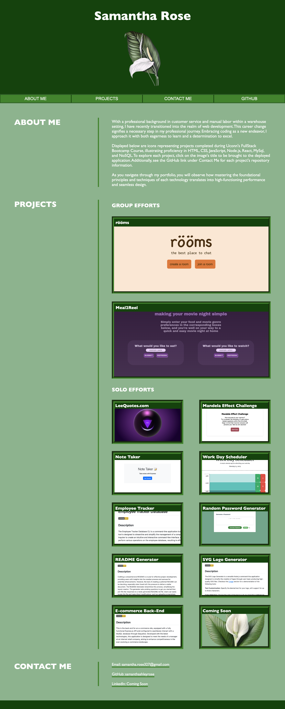

# Samantha Rose's First Coding Portfolio

## Description

Between work emails, social media, and open-source communities (like GitHub) there are a million different ways to learn about a potential employee or colleague. Creating a complete portfolio showcasing my skills, accomplishments, and contact information solves any hassle one may experience. Everything you need to know about me can be found in one convenient place, my personal portfolio. 

## Installation

No installation necessary!

## Usage

You may begin by using the Navigation Links to bring you to your desired topic. The titles attached to the images displaying my projects are active links to the deployed sites. In addition, a link to my GitHub Portfolio is attached to both the GitHub nav icon and my GitHub username (located under Contact Me). <a href="https://samanthashleyrose.github.io/Samantha-Rose-Coding-Portfolio/">View Samantha Rose's Coding Portfolio</a>

## Credits

#### Knowledge Assistance From:
<li>Lee Warrick <a href="https://leewarrick.com/">Personal Portfolio</a></li>
<li>Mia Ciasullo <a href="https://github.com/miacias/first-portfolio">GitHub Portfolio</a></li>
<li>Robby Kurkle (Tutor) <a href="https://github.com/rfnkurle">GitHub Portfolio</a></li>
<li>AskBCS Learning Assistants</li>

#### Documentation Used:

<li><a href="https://chat.openai.com/">ChatGPT</a></li>
<li><a href="https://developer.mozilla.org/en-US/docs/Web/CSS/:root">MDN Web Docs :root</a></li>
<li><a href="https://www.w3schools.com/css/css3_buttons.asp">W3Schools CSS Buttons</a></li>
<li><a href="https://css-tricks.com/snippets/css/a-guide-to-flexbox/">CSS-Tricks A Complete Guide to Flexbox</a></li>
<li><a href="https://www.youtube.com/watch?v=K24lUqcT0Ms">Master Media Queries And Responsive CSS Web Design - Slaying The Dragon YouTube Channel</a></li>

## License

This project is licensed under the <a href="https://opensource.org/licenses/MIT">MIT LICENSE</a> - see the [LICENSE](./LICENSE) file for details.
