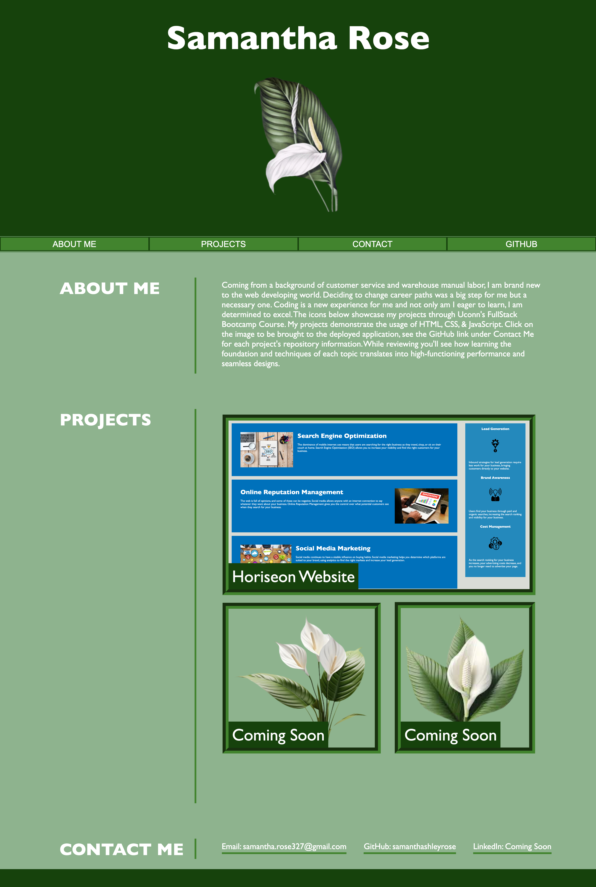

# Samantha Rose's First Coding Portfolio

## Description

Between work emails, social media, and open-source communities (like GitHub) there are a million different ways to learn about a potential employee or colleague. Creating a complete portfolio showcasing my skills, accomplishments, and contact information solves any hassle one may experience. Everything you need to know about me can be found in one convenient place, my personal portfolio. 

During the build of this site I learned the value of:
 - Flexbox and Media Queries
    - When creating a site in today's world it's important to make it responsive for all screen sizes. I admit I did struggle while finding my footing with these CSS tools but I am continuing to get better as I practice with this project.
 - Patience
    - As time goes on my skills will continue to grow and develop. I am eager see how much my portfolio improves as I implement the new skills/techniques that I learn along the way. By the end of this bootcamp course, I intend to have my portfolio functioning on all screens while utilizing HTML, CSS, and JS.

## Installation

N/A

## Usage

You may begin by using the Navigation Links to bring you to your desired topic. The images displaying my projects are active links to the deployed sites. In addition, a link to my GitHub Portfolio is attached to both the GitHub nav icon and my GitHub username (located under Contact Me). <a href="https://samanthashleyrose.github.io/Samantha-Rose-Coding-Portfolio/">View Samantha Rose's Coding Portfolio</a>

## Credits

#### Knowledge Assitance From:
<li>Lee Warrick <link><a href="https://leewarrick.com/">Personal Portfolio</a></link></li>
<li>Mia Ciasullo <link><a href="https://github.com/miacias/first-portfolio">GitHub Portfolio</a></link></li>
<li>Robby Kurkle (Tutor) <link><a href="https://github.com/rfnkurle">GitHub Portfolio</a></link></li>
<li>AskBCS Learning Assistants</li>

#### Documentation Used:

<li><link><a href="https://chat.openai.com/">ChatGPT</a></link></li>
<li><link><a href="https://developer.mozilla.org/en-US/docs/Web/CSS/:root">MDN Web Docs :root</a></link></li>
<li><link><a href="https://www.w3schools.com/css/css3_buttons.asp">W3Schools CSS Buttons</a></link></li>
<li><link><a href="https://css-tricks.com/snippets/css/a-guide-to-flexbox/">CSS-Tricks A Complete Guide to Flexbox</a></link></li>
<li><link><a href="https://www.youtube.com/watch?v=K24lUqcT0Ms">Master Media Queries And Responsive CSS Web Design - Slaying The Dragon YouTube Channel</a></link></li>

## License

Please refer to the MIT LICENSE in the repo.
